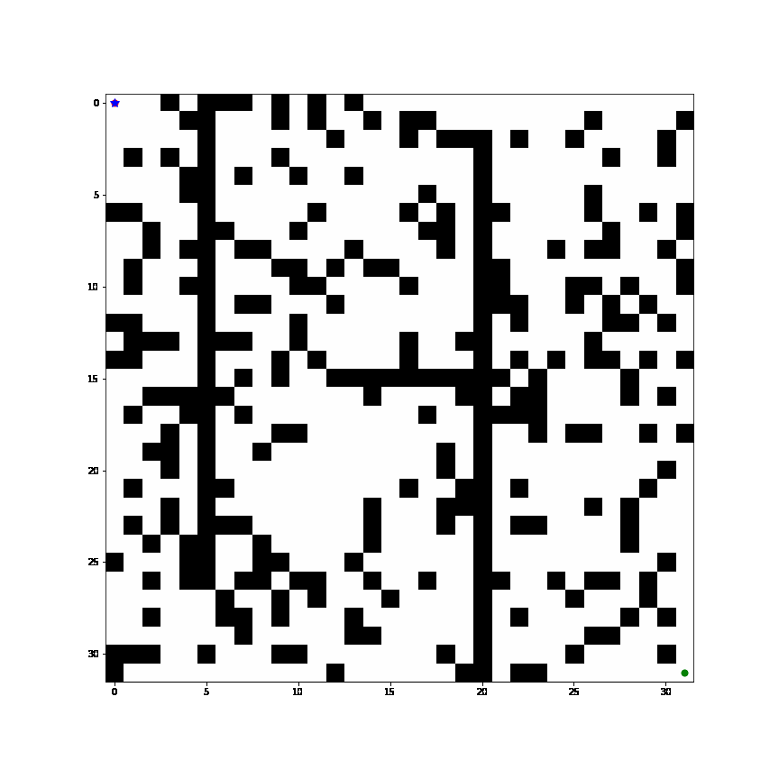
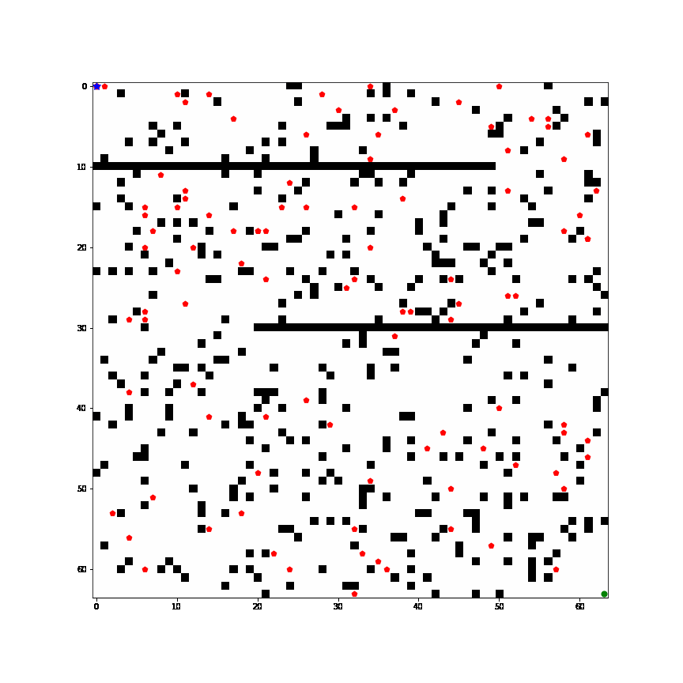

# ECE_7202_Final_Project
## Path planning using value iteration
If both the map and model are know, we use value iteration to find the optimal value functions V* and the optimal path is derived using a greedy policy.

### Model
**Action space S**: up/down/left/right/stay​

**Reward**: **0** for each action; **+10** if enter the goal position (discounting factor = 0.99)​

Task ends when the agent reaches the goal
### Single agent, static enviroment

### Single agent, dynamic enviroment
The location of dynamic obstacles is initialized randomly, and move randomly for each step​

Robot is aware of the nearby obstacles, but doesn't know where they will move

## Path planning using TD method
If the map is unknow, the robot needs to explore the enviroment and find the optimal path

### Single Agent (SARSA/Q-learning, n-steps SASA/Q-learing)
### Mulitple Agents (simultaneously Q-learining)

## Real world application
